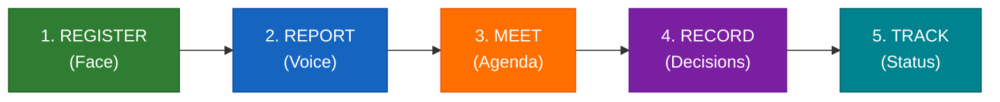
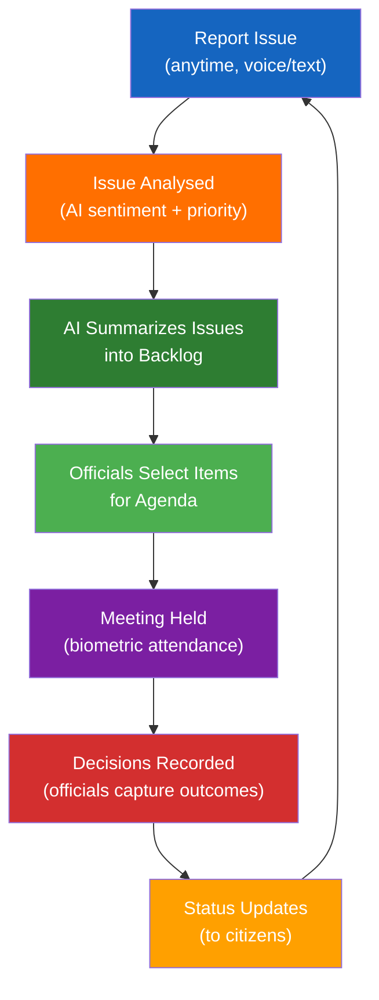
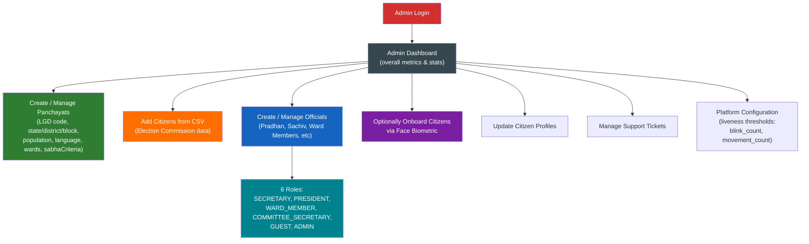
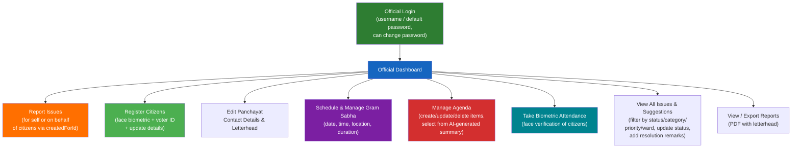
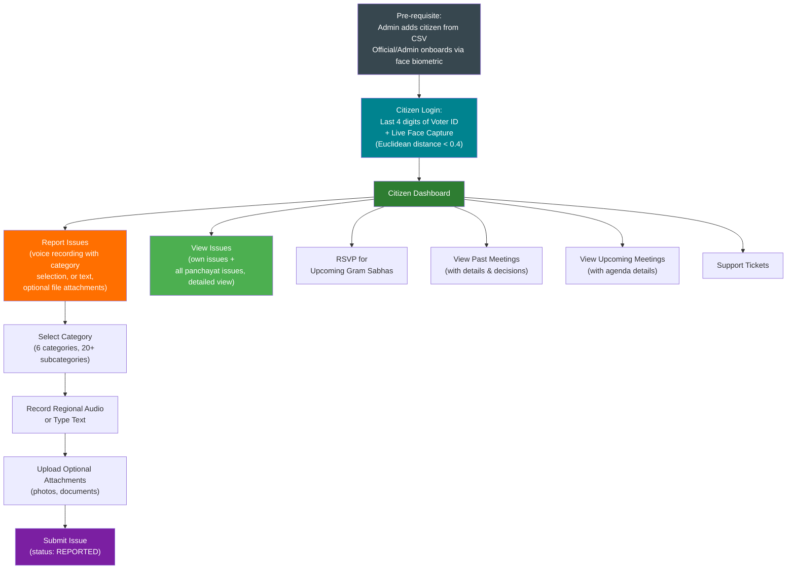
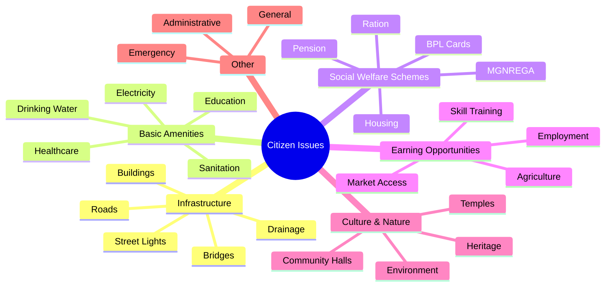
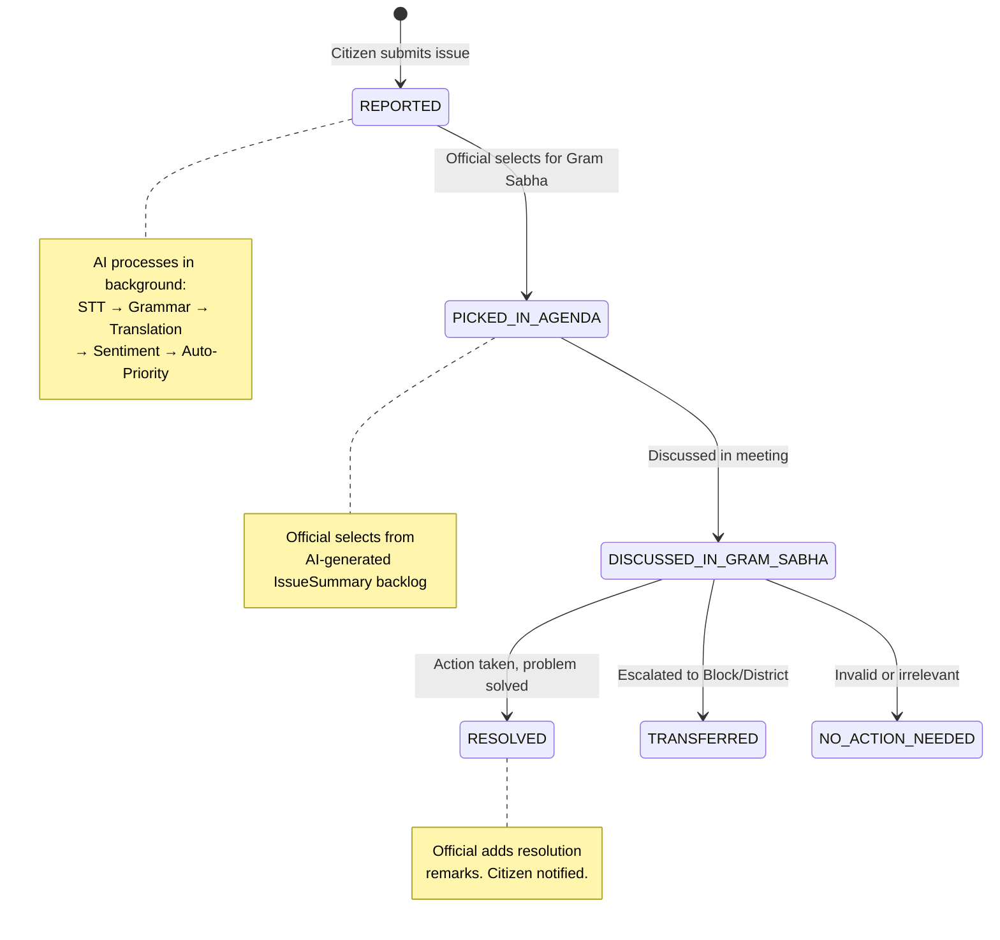
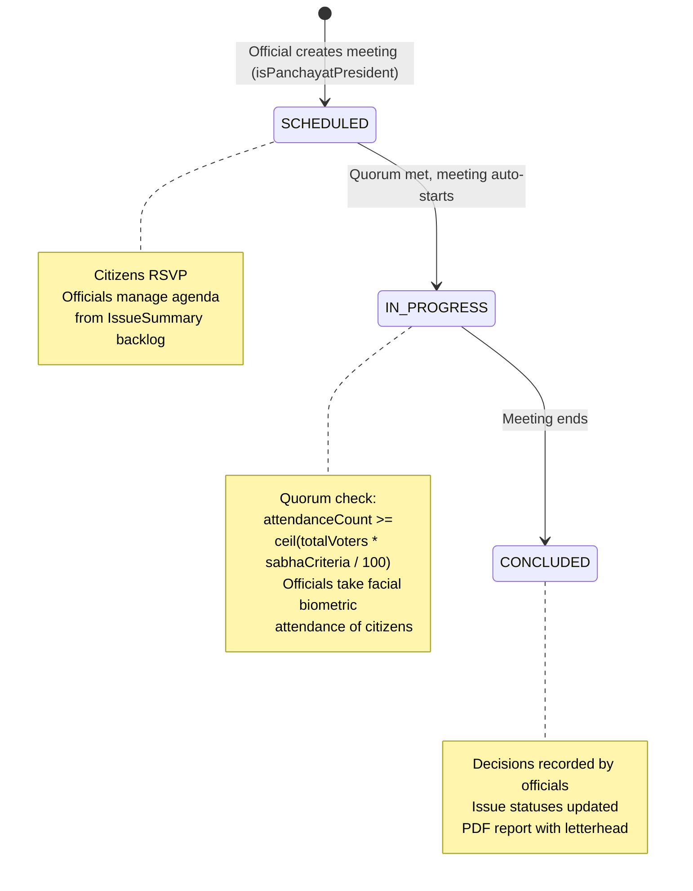
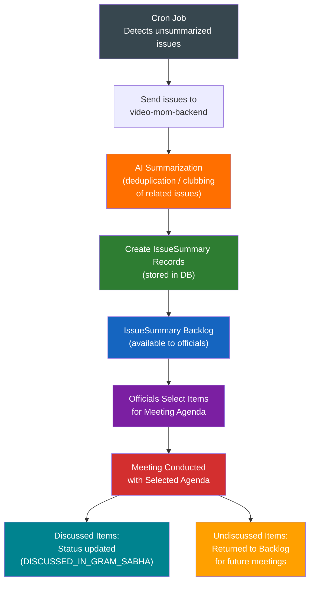
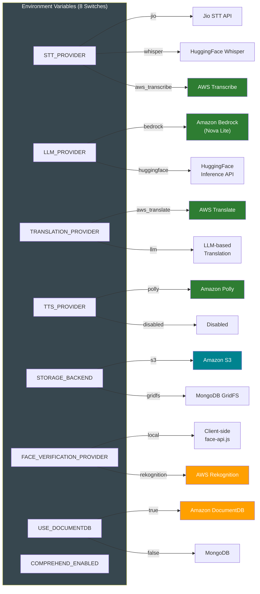

# eGramSabha — Visual Representations

## 5-Step Gram Sabha Lifecycle

| Step | Actor | Action | AI Involvement | AWS Services |
|------|-------|--------|---------------|-------------|
| REGISTER | Official / Admin | Admin adds citizen data from CSV. Official/Admin captures face biometric with liveness (blink + head movement) | Face descriptor extraction (face-api.js, 128-dim) | S3 (face storage), Rekognition (production) |
| REPORT | Citizen | Record voice complaint in native language, anytime | STT → Grammar Correction → Translation → Sentiment | Bedrock, Translate, S3, Transcribe |
| MEET | Official | Schedule Gram Sabha, select issues for agenda | AI summarizes issues into backlog, officials select for agenda | Bedrock, Translate, Polly, SNS |
| RECORD | Official | Officials take facial biometric attendance of citizens to meet quorum. Decisions and outcomes recorded. | Officials capture resolutions and next steps per agenda item | — |
| TRACK | Both | Monitor issue lifecycle, verify resolutions | Auto-priority detection (URGENT flag) | CloudWatch (logging) |

---

## Continuous Governance Loop

Citizens can report issues at any time — the cycle is continuous, not tied to meeting dates. AI summarizes and deduplicates issues into a backlog; officials curate the final agenda. This creates a persistent feedback loop between citizens and local government that did not exist before.

---

## Citizen Journey — 3 Portal Views

### Admin Portal Flow

### Official Portal Flow

### Citizen Portal Flow

---

## Issue Categories & Subcategories

---

## Issue Status Lifecycle

---

## Meeting Status Lifecycle

---

## IssueSummary / Agenda Flow

---

## Provider Abstraction — Vendor Independence

**Benefit**: No code changes needed to switch providers. Enable A/B testing and cost optimization. Scale from hackathon to national deployment by changing config, not code.

---

*Continue to: [Process Flow Diagrams →](./03-process-flows.md)*
