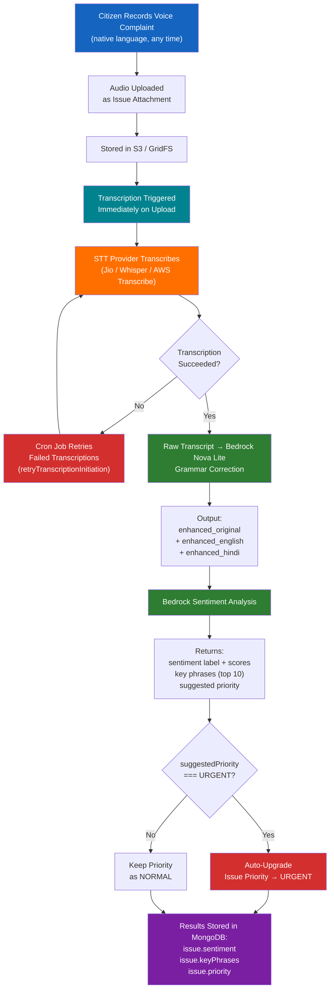
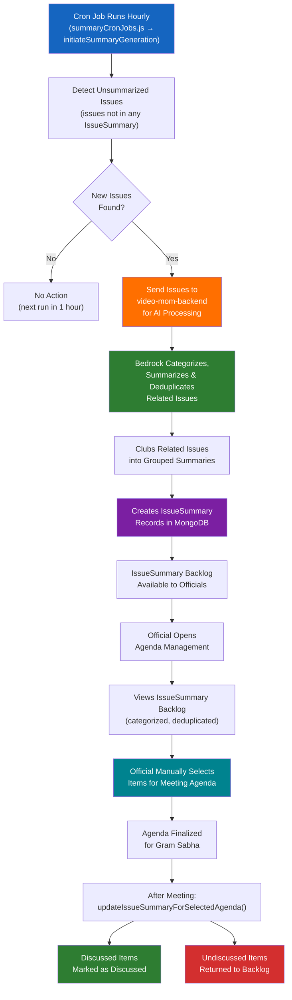
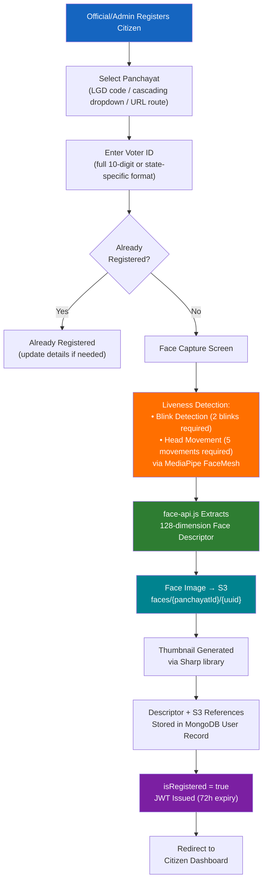
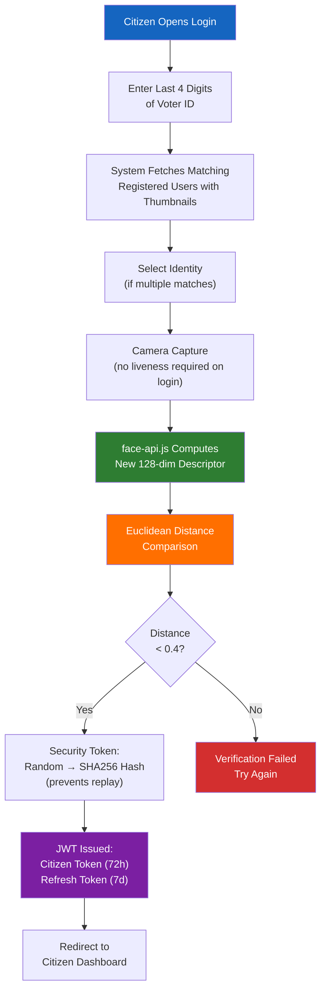
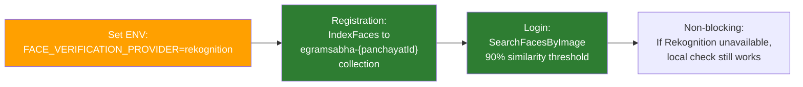
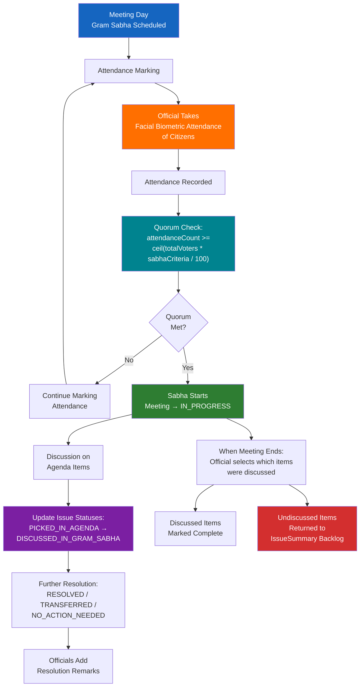
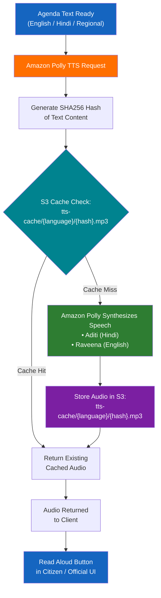

# eGramSabha — Process Flow Diagrams (AI Pipelines)

## Pipeline 1: Voice Issue Reporting

### Detailed Steps

1. **Citizen records voice complaint** in their native language — can be from home, field, or anywhere with phone access
2. **Audio uploaded as issue attachment** along with category selection (6 categories: Infrastructure, Basic Amenities, Social Welfare Schemes, Earning Opportunities, Culture & Nature, Other; 20+ subcategories)
3. **Audio stored** in S3 (production) or GridFS (local dev) based on `STORAGE_BACKEND` env var
4. **Transcription triggered immediately** on audio upload — no waiting for a scheduled job
5. **STT provider transcribes** audio to text — provider selected via `STT_PROVIDER` env var:
   - `jio`: Jio STT API (real-time, Hindi-optimized)
   - `whisper`: HuggingFace Whisper (multilingual, open-source)
   - `aws_transcribe`: AWS Transcribe (24+ languages, batch processing via S3)
6. **If transcription fails**, a cron job (`cronJobs.js` → `retryTranscriptionInitiation`) detects failed transcriptions and retries them
7. **Raw transcript sent to Bedrock** (Nova Lite, Converse API) for grammar correction with rural development context awareness
8. **Output produced in 3 languages**: enhanced text in original language (`enhanced_original`), English translation (`enhanced_english`), and Hindi translation (`enhanced_hindi`)
9. **Sentiment analysis** via Bedrock: analyses corrected transcription for emotional tone and urgency
10. **Returns structured JSON**: sentiment label (POSITIVE/NEGATIVE/NEUTRAL/MIXED) with confidence scores, extracted key phrases (top 10), and suggested priority
11. **Auto-priority**: If health/safety keywords detected (sewage, sick, fire, flood, collapsed, emergency) and strong negative sentiment → `suggestedPriority === 'URGENT'` → auto-upgrades issue priority to URGENT

**Source references**: `cronJobs.js`, `llm_service.py`, `comprehend_service.py`

---

## Pipeline 2: AI Issue Summarization & Agenda Preparation

### Detailed Steps

1. **Cron job runs hourly** (`0 * * * *`) via `summaryCronJobs.js` → `initiateSummaryGeneration`
2. **Detects unsummarized issues** — identifies issues that do not yet appear in any IssueSummary record
3. **Sends issues to video-mom-backend** for AI processing via Bedrock
4. **AI categorizes and summarizes** each issue, deduplicates similar complaints, and clubs related issues together into grouped summaries
5. **Creates IssueSummary records** in MongoDB — each record represents a categorized, deduplicated group of related citizen issues
6. **Officials view IssueSummary backlog** when preparing for an upcoming Gram Sabha meeting
7. **Officials manually select items** from the backlog to include in the meeting agenda
8. **After the meeting**: `updateIssueSummaryForSelectedAgenda()` processes outcomes — items that were discussed are marked accordingly, and undiscussed items are returned to the IssueSummary backlog for future meetings

**Source references**: `summaryCronJobs.js`, `gramSabhaRoutes.js`

---

## Pipeline 3: Face Authentication

### Registration Flow (by Official / Admin)

### Login Flow

### Production Enhancement: AWS Rekognition

### Detailed Steps

**Registration (by Official / Admin):**
Citizens cannot self-register. Admin adds citizen data from CSV (Election Commission data). Official or Admin then onboards the citizen by capturing face biometric:
1. Official/Admin selects panchayat via cascading dropdowns (State -> District -> Block -> Panchayat), LGD code lookup, or direct URL route (e.g., `/Haryana/Palwal/Prithla/Tatarpur`)
2. Enters voter ID — system checks for existing registration (unique constraint: voter ID + panchayat)
3. Face capture screen with real-time liveness verification via MediaPipe FaceMesh:
   - Blink detection: eyes must close & open (2 blinks required, configurable)
   - Head movement: head must move left-right and up-down (5 movements required, configurable)
   - Real-time UI indicators show checkmarks for each verified action
4. face-api.js extracts 128-dimensional face embedding (descriptor)
5. Face image stored in S3 at `faces/{panchayatId}/{uuid}`, thumbnail generated via Sharp
6. Descriptor + S3 references stored in MongoDB user record
7. `user.isRegistered = true`, JWT issued (72-hour expiry)

**Login:**
1. Enter last 4 digits of voter ID (privacy-preserving lookup)
2. System fetches matching registered users with stored thumbnails for visual confirmation
3. Camera capture — single face detection (no liveness check on login for speed)
4. New descriptor computed, Euclidean distance calculated against stored descriptor
5. Threshold: < 0.4 distance units (0 = identical, higher = more different)
6. Security token: random token generated client-side, SHA256 hashed server-side (prevents replay attacks)
7. On match: JWT issued with payload `{id, name, voterIdNumber, panchayatId, wardId, userType: 'CITIZEN'}`

**Source references**: `citizenAuthRoutes.js`, `FaceRegistration.js`

---

## Pipeline 4: Meeting Day Flow

### Detailed Steps

1. **Meeting day begins** — the Gram Sabha is scheduled, officials and citizens arrive
2. **Officials take facial biometric attendance** of citizens based on their availability, ensuring accountability of their presence
3. **Quorum check**: system continuously evaluates `attendanceCount >= ceil(totalVoters * sabhaCriteria / 100)` where `sabhaCriteria` is the configured percentage threshold for the panchayat
4. **When quorum is met**, the meeting auto-transitions to `IN_PROGRESS` status
5. **During and after the meeting**, officials update issue statuses through the lifecycle:
   - `PICKED_IN_AGENDA` -> `DISCUSSED_IN_GRAM_SABHA` -> `RESOLVED` / `TRANSFERRED` / `NO_ACTION_NEEDED`
6. **Officials add resolution remarks** documenting decisions and outcomes for each discussed issue
7. **MOM generation** from meeting recording is planned via the video-mom-backend module (see [Planned / Future](#planned--future))
8. **When the meeting ends**, official selects which items were actually discussed in the Gram Sabha. `updateIssueSummaryForSelectedAgenda()` processes all agenda items:
   - Items that were discussed are marked as complete
   - Items left undiscussed are moved back to the IssueSummary backlog to be picked in agenda again for future meetings

**Source references**: `gramSabhaRoutes.js`

---

## Pipeline 5: Text-to-Speech (Agenda Read Aloud)

### Detailed Steps

1. **Agenda text is available** in English, Hindi, or regional language after agenda preparation
2. **TTS request initiated** — system sends the text content to the TTS service
3. **SHA256 content hash computed** from the text content to serve as a cache key
4. **S3 cache lookup** at path `tts-cache/{language}/{hash}.mp3`:
   - **Cache hit**: existing audio file is returned immediately, no Polly API call needed
   - **Cache miss**: Amazon Polly synthesizes speech, audio is stored in S3, then returned
5. **Voice selection**:
   - Aditi voice for Hindi content
   - Raveena voice for English content
6. **Audio delivered to client** and played via the Read Aloud button in the citizen or official UI

**Source reference**: `tts_service.py`

---

## Planned / Future

### MOM Generation

A separate `video-mom-backend` module exists for generating Minutes of Meeting from meeting recordings. The pipeline: meeting audio/video is uploaded → transcribed via STT → sent to Bedrock which generates a structured MOM containing Meeting Overview, Discussion Points, Decisions Taken, Action Items, and Next Steps → output translated into 3 languages (English, Hindi, and regional). This module is built but not yet integrated into the main eGramSabha application. Full integration is planned for a future release.

### eSign

Planned — digital signatures on Gram Sabha agenda and Minutes of Meeting by the Pradhan and other ward members. Will provide official authentication of meeting records and decisions. Not yet implemented.

### Citizen Self-Attendance

Planned — allow citizens to mark their own attendance via face biometric at the meeting venue, in addition to official-marked attendance.

---

*Continue to: [Architecture Diagram ->](./04-architecture.md)*
