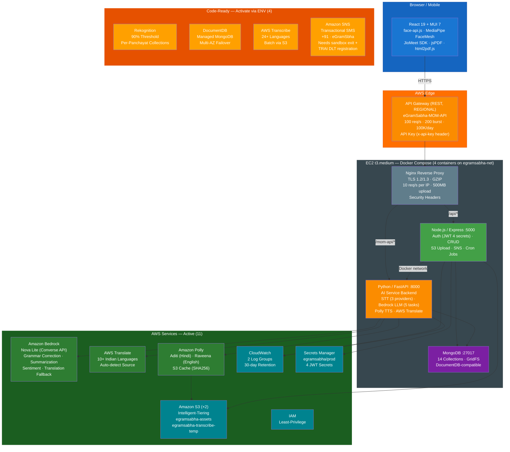
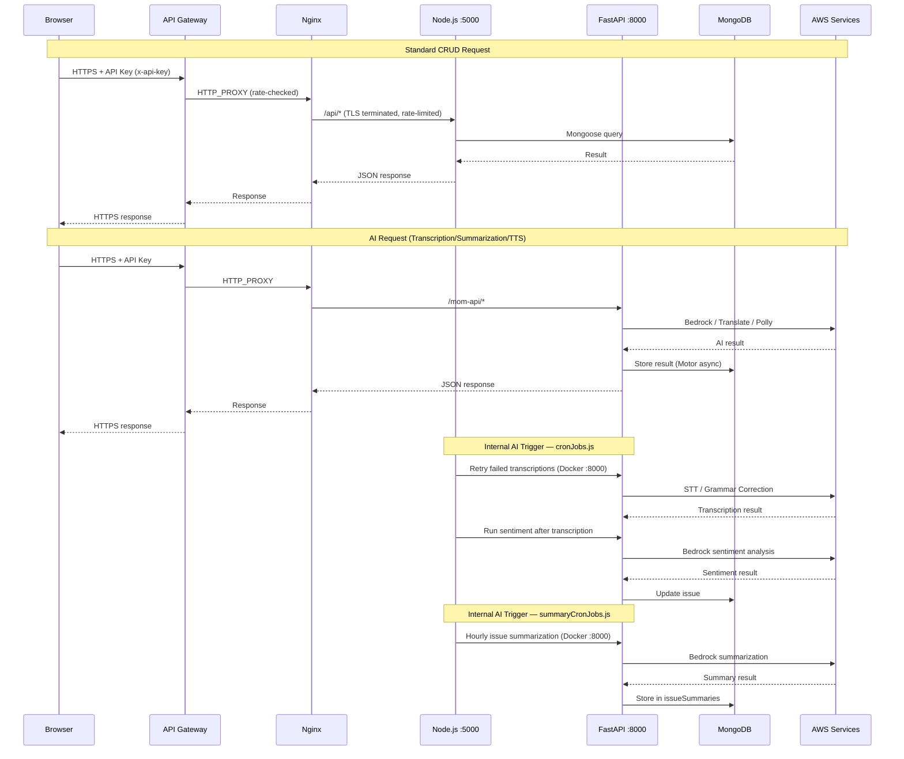
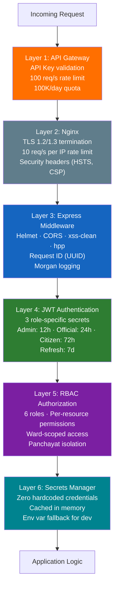
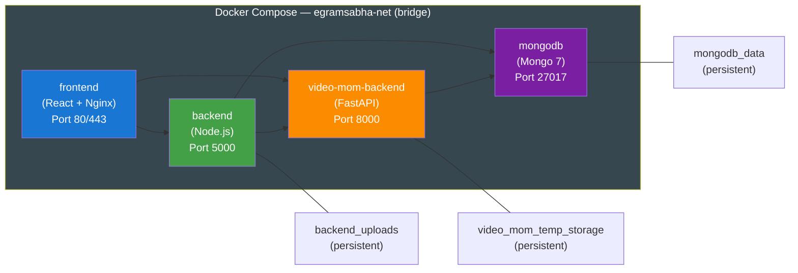

# eGramSabha — Architecture Diagram

## System Architecture Overview

---

## Architecture Layers

### Layer 1: Frontend (Browser/Mobile)

| Component | Purpose |
|-----------|---------|
| React 19 | Single Page Application framework |
| MUI 7 (Material-UI) | UI component library with responsive design |
| face-api.js | 128-dimension face descriptor extraction for authentication |
| MediaPipe FaceMesh | Real-time liveness detection (blink + head movement) |
| JioMeet SDK | Virtual meeting integration for remote Gram Sabha participation |
| jsPDF + html2pdf.js | Client-side PDF generation with Hindi font support |
| Axios | HTTP client for API communication |
| React Context | State management for auth and language switching |

### Layer 2: AWS Edge — API Gateway

| Property | Value |
|----------|-------|
| API Name | eGramSabha-MOM-API |
| Type | REST API (REGIONAL endpoint) |
| Stage | prod |
| Rate Limit | 100 requests/second |
| Burst | 200 requests |
| Daily Quota | 100,000 requests/day |
| Auth | API Key required (x-api-key header) |
| Integration | HTTP_PROXY to Nginx on EC2 |
| Timeout | 29 seconds |
| Monitoring | CloudWatch tracing enabled (X-Ray), INFO level logging |

### Layer 3: Nginx Reverse Proxy

| Property | Value |
|----------|-------|
| HTTPS | HTTP → HTTPS redirect on port 80 |
| TLS | 1.2 and 1.3 only, high cipher suites |
| Compression | GZIP enabled (text, JSON, JavaScript, SVG) |
| Max Upload | 500 MB |
| Proxy Timeout | 300 seconds (read/send) |
| Rate Limit | 10 req/sec per IP with 20 burst (for /api/) |
| Security Headers | X-Frame-Options, X-Content-Type-Options, X-XSS-Protection, Referrer-Policy, HSTS |
| Static Cache | 30-day expires for .js, .css, images, fonts |
| Routing | `/` → React frontend, `/api/*` → Node.js :5000, `/mom-api/*` → FastAPI :8000 |

### Layer 4: Node.js / Express Backend (:5000)

| Responsibility | Details |
|---------------|---------|
| Authentication | JWT with 4 secrets (Admin 12h, Official 24h, Citizen 72h, Refresh 7d). Secrets from Secrets Manager. |
| CRUD Operations | RESTful API for panchayats, officials, citizens, issues, meetings, wards, RSVPs |
| File Management | S3 upload/download for face images, letterheads, attachments |
| Cron Jobs | `cronJobs.js`: retries failed transcriptions, runs sentiment after transcription. `summaryCronJobs.js`: hourly issue summarization for agenda backlog. |
| Notifications | SNS SMS on meeting scheduling (integrated but requires AWS sandbox exit + TRAI DLT registration for actual delivery) |
| Security | Helmet, CORS, xss-clean, hpp, express-rate-limit, bcryptjs |
| Logging | Winston + winston-cloudwatch → CloudWatch `/egramsabha/backend` |

### Layer 5: Python / FastAPI AI Backend (:8000)

The `video-mom-backend` service is the AI service backend. It handles speech-to-text, LLM-powered text processing, text-to-speech, and translation. MOM generation capability exists in the codebase as a separate module but is not yet integrated into the main application workflow.

| Responsibility | Details |
|---------------|---------|
| Speech-to-Text | 3 providers (Jio/Whisper/AWS Transcribe) via STT_PROVIDER env var |
| LLM Tasks (4 active) | Bedrock Nova Lite: grammar correction, issue summarization (for agenda backlog), sentiment analysis, translation fallback. MOM generation available in module (planned integration). |
| Text-to-Speech | Amazon Polly with S3 SHA256 caching |
| Translation | AWS Translate for AI-generated content across 10+ Indian languages |
| Sentiment | Bedrock-based: sentiment label/scores, key phrases, suggested priority |
| Async Processing | Motor (async MongoDB driver) for non-blocking database operations |
| Logging | watchtower → CloudWatch `/egramsabha/video-mom` |

### Layer 6: MongoDB (:27017)

14 collections with DocumentDB-compatible schemas:

| Collection | Purpose | Key Fields |
|-----------|---------|-----------|
| users | Citizen profiles | voterIdNumber, faceDescriptor (128-dim array), faceImageId, panchayatId, isRegistered |
| officials | Panchayat officials | name, role (6 roles), panchayatId, password (bcrypt), isActive |
| panchayats | Gram Panchayat registry | name, lgdCode, state, district, block, population, language, wards[], letterheadImageId |
| wards | Sub-divisions | name, wardNumber, population, panchayatId |
| gramsabhas | Meeting records | title, dateTime, location, agenda[], issues[], attendances[], minutes, transcript, status |
| issues | Citizen complaints | text, category, subcategory, priority, status, statusHistory, sentiment, keyPhrases, transcription |
| issueSummaries | AI-generated summaries | panchayatId, summary, insights |
| summaryRequests | Async job tracking | status (PENDING/PROCESSING/COMPLETED/FAILED), requestId, retryCount |
| rsvps | Meeting RSVPs | gramSabhaId, userId, status |
| roles | Role definitions | name (ADMIN/SECRETARY/PRESIDENT/WARD_MEMBER/COMMITTEE_SECRETARY/GUEST), permissions[] |
| supporttickets | Help desk tickets | subject, description, status, priority, createdBy |
| platformconfigs | System config | liveness settings (blink_count, movement_count), feature flags |
| modelrefs | Reference constants | metadata |
| requests | AI processing queue | status, requestType, result (Python backend, Motor) |

Docker volumes: `mongodb_data`, `backend_uploads`, `video_mom_temp_storage`

---

## Traffic Flow

---

## Security Architecture

### RBAC Role Hierarchy

| Role | Scope | Key Permissions |
|------|-------|----------------|
| ADMIN | System-wide | All operations. Bypasses permission checks. |
| SECRETARY | Panchayat | Full panchayat management, meeting CRUD, citizen management, all wards |
| PRESIDENT | Panchayat | Meeting conduct, agenda approval, all wards |
| WARD_MEMBER | Ward | Issues in assigned ward only, attendance marking |
| COMMITTEE_SECRETARY | Panchayat | Meeting notes, limited management |
| GUEST | Read-only | View meetings and public issues only |
| CITIZEN | Own data | Submit issues, RSVP, view own status, support tickets |

---

## Docker Compose Topology

| Container | Image Base | Port | Health Check | Depends On |
|-----------|-----------|------|-------------|-----------|
| frontend | Node → Nginx (multi-stage) | 80, 443 | — | backend, video-mom-backend |
| backend | Node.js | 5000 (internal) | — | mongodb |
| video-mom-backend | Python | 8000 (exposed) | Every 30s | mongodb |
| mongodb | mongo:7 | 27017 (internal) | — | — |

**Source references**: `docker-compose.prod.yml`, `infra/setup-api-gateway.js`, `frontend/nginx.prod.conf`

---

*Continue to: [Technologies & Cost →](./05-technologies-cost.md)*
